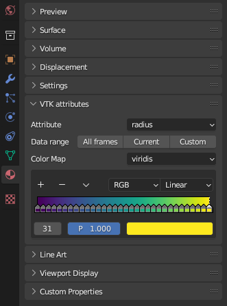

# blender-vtk-importer
- Import VTK files (VTK, VTU, VTP, VTM)
- Store data as attributes
- Import sequence of files 

  
  

# Installation
- Download the ZIP file from this repository
- In Blender, Edit > Preferences > Add-ons > Install... find the zip file that you just downloaded and click `Install Add-on`
- Enable the add-on by clicking the checkbox (this will install the required python dependencies)
- You are ready to import VTK files in File > Import > VTK

# A few things to know
- Several files can be imported at the same time by selecting them all
- If the pattern filename-*.vtk is detected with `*` being a sequence of numbers, the mesh is updated for each frame when playing the animation
- When importing a sequence, the first and last frames of the blender animation are updated according to the data
- To make the data range fit the minimal and maximal values of the current attribute over all the time steps, the aniation must be played for all frames to initialize the data
- To reverse the color map, in the material properties > VTK attributes > down arrow > Flip Color Ramp
- When a VTK file containing only a list of points (no edges, no faces) with a `radius` attribute, the mesh is converted to a point cloud and the render parameters are set to work with `CYCLES` on the GPU.

# TODO
- Color legend
- Mesh Edges